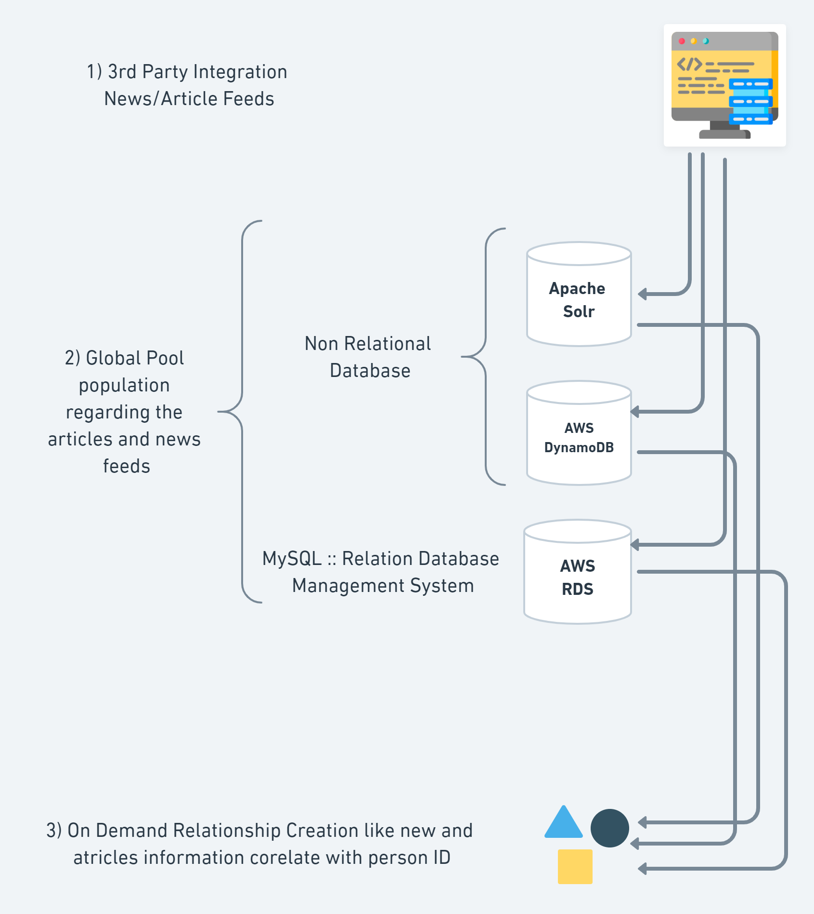
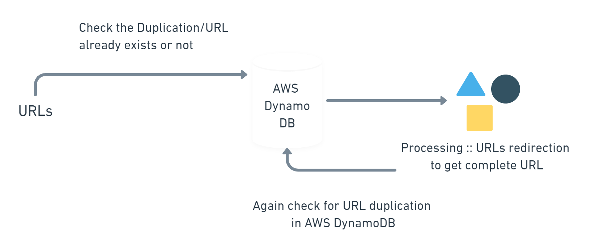
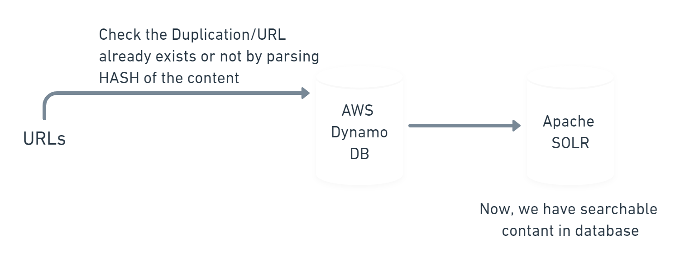

<h1>xiQ Database Documentation</h1>

Regarding the database architecture, how the data is dumping from where/how many sources into xiQ database, we need to get familier first with few terminologies as following: 

1. Relational Database Management System (RDBMS)
2. Non-Relational Database Management System
3. Amazon Relational Database Service (RDS)
4. Amazon DynamoDB
5. APACHE SOLR
6. Serverless Architecture
7. Tables related inofmation
8. CRON Jobs

 
<h2>Relational Database Management System</h2>

---
A relational database management system (RDBMS) is a database management system (DBMS) that is based on a relational model in which data is stored in the form of tables and the relationship among the data is also stored in the form of tables.
<https://documentation.progress.com/output/ua/OpenEdge_latest/index.html#page/gsdev/understanding-the-rdbms-architecture.html>

 
<h2>Non-Relational Database Management System</h2>

---
A non-relational database is a database that does not use the tabular schema of rows and columns found in most traditional database systems. Instead, non-relational databases use a storage model that is optimized for the specific requirements of the type of data being stored. For example, data may be stored as simple key/value pairs, as JSON documents, or as a graph consisting of edges and vertices.
<https://docs.microsoft.com/en-us/azure/architecture/data-guide/big-data/non-relational-data#:~:text=A%20non%2Drelational%20database%20is,type%20of%20data%20being%20stored>

 
<h2>Amazon Relational Database Service (RDS)</h2>

---
Amazon Relational Database Service (Amazon RDS) makes it easy to set up, operate, and scale a relational database in the cloud. It provides cost-efficient and resizable capacity while automating time-consuming administration tasks such as hardware provisioning, database setup, patching and backups. It frees you to focus on your applications so you can give them the fast performance, high availability, security and compatibility they need. 
Amazon RDS is available on several database instance types - optimized for memory, performance or I/O - and provides you with six familiar database engines to choose from, including Amazon Aurora, PostgreSQL, MySQL, MariaDB, Oracle Database, and SQL Server. You can use the AWS Database Migration Service to easily migrate or replicate your existing databases to Amazon RDS. 
<https://aws.amazon.com/rds/>

 
<h2>Amazon DynamoDB</h2>

---
Amazon DynamoDB is a key-value and document database that delivers single-digit millisecond performance at any scale. It's a fully managed, multiregion, multimaster, durable database with built-in security, backup and restore, and in-memory caching for internet-scale applications. DynamoDB can handle more than 10 trillion requests per day and can support peaks of more than 20 million requests per second.

Many of the world's fastest growing businesses such as Lyft, Airbnb, and Redfin as well as enterprises such as Samsung, Toyota, and Capital One depend on the scale and performance of DynamoDB to support their mission-critical workloads.

Hundreds of thousands of AWS customers have chosen DynamoDB as their key-value and document database for mobile, web, gaming, ad tech, IoT, and other applications that need low-latency data access at any scale. Create a new table for your application and let DynamoDB handle the rest. 
<https://aws.amazon.com/dynamodb/>

 
<h2>APACHE SOLR</h2>

---
Solr is highly reliable, scalable and fault tolerant, providing distributed indexing, replication and load-balanced querying, automated failover and recovery, centralized configuration and more. Solr powers the search and navigation features of many of the world's largest internet sites. 
<https://lucene.apache.org/solr/>

 
<h2>Serverless Architecture</h2>

---
Serverless is the native architecture of the cloud that enables you to shift more of your operational responsibilities to AWS, increasing your agility and innovation. Serverless allows you to build and run applications and services without thinking about servers. It eliminates infrastructure management tasks such as server or cluster provisioning, patching, operating system maintenance, and capacity provisioning. You can build them for nearly any type of application or backend service, and everything required to run and scale your application with high availability is handled for you. 

Serverless enables you to build modern applications with increased agility and lower total cost of ownership. Building serverless applications means that your developers can focus on their core product instead of worrying about managing and operating servers or runtimes, either in the cloud or on-premises. This reduced overhead lets developers reclaim time and energy that can be spent on developing great products which scale and that are reliable.

AWS provides a set of fully managed services that you can use to build and run serverless applications. Serverless applications don’t require provisioning, maintaining, and administering servers for backend components such as compute, databases, storage, stream processing, message queueing, and more. You also no longer need to worry about ensuring application fault tolerance and availability. Instead, AWS handles all of these capabilities for you. This allows you to focus on product innovation while enjoying faster time-to-market.
 
<https://aws.amazon.com/serverless/#:~:text=Serverless%20is%20the%20native%20architecture,services%20without%20thinking%20about%20servers.>

So, the whole process of data gathering and dumping is divided into 3 steps:
1. All the 3rd party integrations for data dumping by using servers where CRON jobs are running as per schedule. like every hour/15mins/30mins etc, where every othe job is different.
2. All the data is dumping into database
3. Then it comes the corelation the data

**Step 1**...  We will talk about RSS feeds,Google/Bing and Twitter. We have some links regarding the articles and news along meta data like links etc so we dump this data and check the duplication of the links. we also have global pool table named as **rss_sources** containing raw data web links and date as well as all those links that we add personally while creating asset in workbench. 
So, if we talk about the Google/Bing, we are getting all information related to article and news through APIs, we actually concatinate the search/term/keys/values and in return it will give us json result having URLs. All this kind of stuff is being done on Servers where CRON jobs are running after eery 15/30/60mins to check the rss_source duplication.

GOOGLE & BING :: We get/search through the public URLs regarding the articles and news feeds, the same jobs work on URLs to check and avoid duplication.
TWITTER :: from twitter there is table in our database named as **twitter_sources** having twitter handles containing information about post and link, same like google and bing, jobs run and check every newly available links from table that this link/tweet has article link/news link NewYork Times/Wall Street Journal e.g in it or not, which is very important. 
Sometimes the tweets are also very important in case company's tweet, person tweet from CEO/ CCO/ CTO/ CFO of XYZ Company. 
So, if the information is related to the company or person then the information will be saved into comapany's table or person table and rest of global information will be saved into global table named as **twitter_sources** . 

SERVERLESS :: After all the process, now we have fresh web links in out database, now we time come to extract information from all the available article/news links, for that we developed some custom logics as well as we use some 3rd party services like **Embedly** e.g . These kind of services ha been developed or been created that will get atricle/news links from our database and return it back information from those gien links as the Title/Description/Date. 

Amazon DynamoDB :: The sole purpose was to use it is to Duplication Detection and for that we have to provide some information as following ::
1. Article/New Link ID (Which is self generated by in the table by database)
2. Article/New Weblink
3. place Article contant hash

So by providing these information we can check the duplication.

APACHE SOLR :: is basically NonRelationa Database as well as it is open based search engine which is being use as search engine at xiQ for quick searching. So the flow will be like first we get the URLs and redirect the links and again search into databse for duplication, of the link is not being duplicated then we check the hash of the content the same from database and the result as unduplicated URLs will be saved into database.
URL_AWSDynamoDB

Afer this process, We get the URL/WEblink regarding the article we parse the hash of the contetent and then again check the URL duplication from AWS DynamoDB whether the URL already exists or not then save it into APACHE SOLR. So now we have searchable content in APACHE SOLR database.
url_hash_solr

Lets have few table names and description taht are containing what information

| Table Name | Description |
| ----------- | ----------- |
| rss_sources | RSS Feeds -> Article Links and Title |
| twitter_sources|Twitter Handler -> Twitter Source|
| person_twitter| Person related information will be saved here corelated with twitter post/handler|
| contact| Person Contact related information like firstname/lastname/email e.g|
| daily_bulletin_master| CompanyID/Name/logo/title|
| business_unit_sections| GroupName/CompanyID|
| article| ArticleID/link/source/imageURL/hash value|
|twitter_update| TweeterID/link/title/companyID/ProfilePic/handler|
|searchterm_BU| ID/BuildID/SearchTerm|

Now, we have few tables related to tagging process as follwoing ::

| Table Name | Description |
| ----------- | ----------- |
| company_feeds| Having relations regarding company news/tweets/person news/person tweets relation|
|daily_bulletin_BU|Containing information related to digest|
|daily_bulletin_searchterms| Match searched terms against serched article|
|alerts| Containing information regarding the news/banking feeds e.g|
|hottopics|industries related data|
|users|internal Users/app users|
|user_company|all companies that user added|
|user_hottopics|all industries that user added|
|user_note|all the notes that user take|
|user_searches|User added inofrmation /person/company|
|user_tokens|User device information, device logged in information, use for push notification|
|ignorelist_BU|Block list related infrmation|
|daily_bulletin_master_parameters|use for auto curation/change algorithm e.g|

CRON Jobs :: Cron is one of the most useful utility that you can find in any Unix-like operating system. It is used to schedule commands at a specific time. These scheduled commands or tasks are known as “Cron Jobs”. Cron is generally used for running scheduled backups, monitoring disk space, deleting files (for example log files) periodically which are no longer required, running system maintenance tasks and a lot more. In this brief guide, we will see the basic usage of Cron Jobs in Linux. 
<https://crontab.guru/>